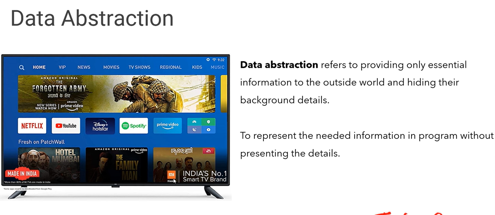

# Abstraction and Encapsulation

Data abstraction and encapsulation are synonymous as data abstraction is achieved through encapsulation. Abstraction is used to hide internal details and show only functionalities. Abstracting something means to give names to things, so that the name captures the basic idea of what a function or a whole program does. Encapsulation is used to restrict access to methods and variables. In encapsulation, code and data are wrapped together within a single unit from being modified by accident.

## What is abstraction and encapsulation with an example?

Encapsulation hides data, preventing the users from directly accessing it, (providing controlled access) which is also known as data hiding. `Abstraction focuses on “what” the object does . Encapsulation focuses on “How” the object does it`. Example: CAR – the driver of the car only needs to know how to drive it.

Encapsulation hides variables or some implementation that may be changed so often in a class to prevent outsiders access it directly. They must access it via getter and setter methods.

Abstraction is used to hide something too, but in a higher degree (class, interface). Clients who use an abstract class (or interface) do not care about what it was, they just need to know what it can do.

